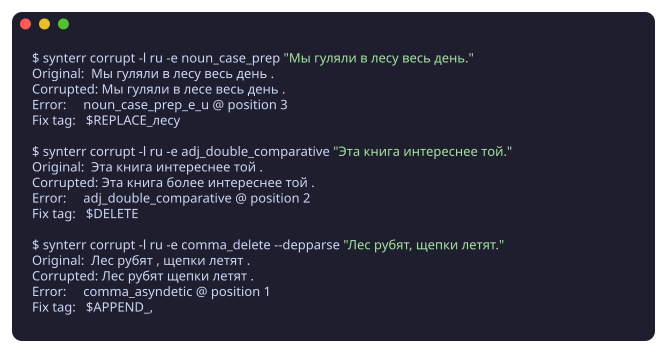
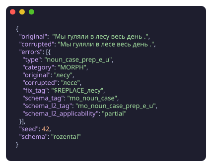

# synterr

**Reproducible synthetic error generation for Grammatical Error Correction.**

Synterr corrupts clean text with linguistically-motivated errors and labels
each one with the rule it violates. The output is training data for GEC
models, with two properties most synthetic-corruption tools don't have:

- **Every error has a defensible label.** Each corruption maps to a
  Rozental § paragraph (or RLC tag, or ERRANT tag). You can filter,
  re-weight, and audit by rule.
- **Every error has a syntactic justification.** Government, agreement,
  and punctuation handlers use dependency-tree heuristics to fire on the
  right syntactic positions, not arbitrary tokens.

## Where to start

- New to synterr? → [Getting started](getting-started.md)
- Text in, tagged errors out? → [Pipeline](pipeline.md)
- Want to understand the design? → [Architecture](architecture.md)
- Looking for a specific error type? → [Error types](error-types.md)
- Trying to reproduce paper results? → [Reproducibility](reproducibility.md)

## Quick taste

Every corruption carries its handler-level error type; select a schema at
generation time (`--schema rozental`) and each error is additionally
labeled with §-grounded taxonomy tags:

## Citation

If you use synterr in research, please see the [Citation block in the
README](https://github.com/synterr-nlp/synterr#citation).
