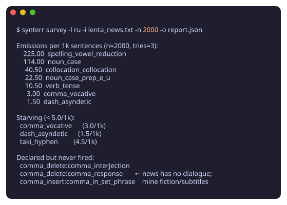
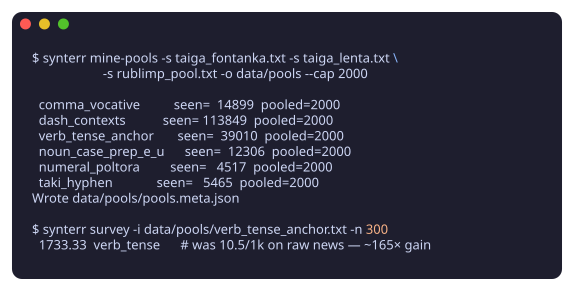

# The pipeline: text in, tagged errors out

This page is the end-to-end contract: what you feed synterr, what comes
out, and what every tag on the output means. The three stages are
independent CLI commands — you can run just stage 3, but stages 1–2 are
how you make sure your corpus can actually feed the error classes you
care about.

```
clean text ──► 1. survey ──► starving classes
                                  │
                  2. mine-pools ◄─┘
                        │
   per-class pools ─────┤
   + base corpus  ──────┴──► 3. generate ──► tagged training pairs
```

## Stage 0 — prepare input

Plain UTF-8 text, **one sentence per line**. Sentences shorter than five
words are skipped. The text must be *clean* (grammatical) — synterr
corrupts it; it does not correct.

## Stage 1 — survey: what can this corpus feed?

```bash
uv run synterr survey -l ru -i clean.txt -n 2000 -o report.json
```



Runs every handler over a sample and reports **emissions per 1k
sentences** for each error subtype, plus two actionable lists:

- **starving** — subtypes below threshold (default 5/1k); your corpus
  rarely contains the contexts they need
- **never fired** — subtypes that found no context at all (on news text
  these are typically dialogue phenomena: interjections, да/нет
  responses, vocatives)

Why subtypes starve: precision gates. Handlers refuse to corrupt when
the result wouldn't be a recoverable error — `verb_tense` needs a
temporal anchor (*вчера/завтра*), `noun_number` needs an agreement
witness, dash deletion skips contexts where Rozental permits both
variants. On plain news text `verb_tense` applies in ~3 of 1000
sentences. That's correct behavior; fix the *corpus*, not the gate.

## Stage 2 — mine-pools: feed the starving classes

```bash
uv run synterr mine-pools \
    -s big_corpus_1.txt -s big_corpus_2.txt \
    -o data/pools --cap 2000
```



Sweeps large sources with per-class surface patterns and
reservoir-samples up to `--cap` candidate sentences per class into
`data/pools/<class>.txt` (+ `pools.meta.json` with seen/sampled counts).

Two design points worth knowing:

- **Patterns derive from the live handler lexicons** (frozen phrases,
  adverb pair lists, …) where possible, so pools cannot drift out of
  sync with the handlers.
- **Pools are recall-oriented.** A pool only needs to contain
  *candidates*; the handler's own `can_apply` does the precise filtering
  at generation time. Measured effect: `verb_tense` fires at 10.5/1k on
  raw news vs ~1700/1k on its mined pool.

To verify a pool feeds its class, survey it: `synterr survey -i
data/pools/<class>.txt`.

## Stage 3 — generate: tagged training pairs

```bash
uv run synterr generate -l ru --preset rulec --schema rozental \
    -i mixed_sources.txt -o train.jsonl --output-format jsonl --seed 42
```

- `--preset` controls **how often** each error type fires (corpus-derived
  weights: `rulec` = L2 learner essays, `gera` = native school texts,
  `lorugec` = benchmark-rule uniform, `balanced` = flat).
- `--schema` controls **what the errors are called** (see below).
- `--seed` makes the run reproducible.

### Output contract (JSONL)

One record per corrupted sentence:

```json
{
  "original":  "Мы гуляли в лесу весь день .",
  "corrupted": "Мы гуляли в лесе весь день .",
  "errors": [
    {
      "type": "noun_case_prep_e_u",
      "category": "MORPH",
      "start_idx": 3, "end_idx": 4,
      "original": "лесу", "corrupted": "лесе",
      "fix_tag": "$REPLACE_лесу",
      "schema_tag": "mo_noun_case",
      "schema_l2_tag": "mo_noun_case_prep_e_u",
      "schema_l2_applicability": "partial"
    }
  ],
  "seed": 42, "schema": "rozental"
}
```

Field by field:

| field | meaning |
|---|---|
| `type` | synterr's internal error subtype (handler-level truth) |
| `category` | detection category: SPELL / MORPH / PUNCT / OTHER |
| `start_idx`, `end_idx` | token span of the edit in the corrupted sentence |
| `fix_tag` | GECToR-style correction tag (`$REPLACE_x`, `$APPEND_x`, `$DELETE`) |
| `schema_tag` | L1 tag in the chosen schema (e.g. Rozental working tag) |
| `schema_l2_tag` | fine-grained L2 tag, mapped to specific Rozental §§ |
| `schema_l2_applicability` | `full` / `partial` / `none` — does the native Rozental rule describe this error as L2 learners make it (see below) |

### Reading `schema_l2_applicability`

The Rozental schema is a *native* taxonomy; this field is the bridge to
the *learner* population, rated per fine-grained tag:

- **full** — the Rozental § directly describes the error both natives
  and learners make (all spelling and punctuation classes)
- **partial** — Rozental describes a variant choice; learners produce
  broader errors in the same territory (e.g. *в лесу→в лесе* is the
  native variant slip; a learner more often picks a wrong case entirely)
- **none** — no bridge: either a native-only phenomenon or a
  learner-only error Rozental has no § for (word omission/insertion)

A few basic-agreement subtypes (`adj_case`, `verb_tense`, …) carry an L1
tag but no L2 tag — Rozental's fine-grained level has no slot for basic
agreement errors — so they emit no applicability field.

Filtering a corpus by population is therefore a one-liner: keep
`full` for native-style data, `full`+`partial` for learner-style data,
and treat `none` as schema-extension territory.
